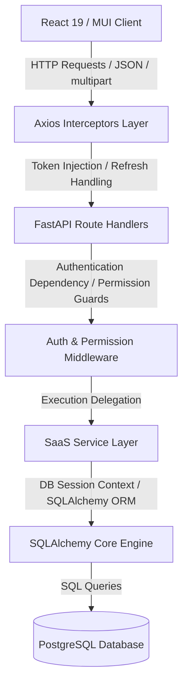
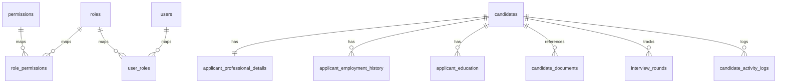
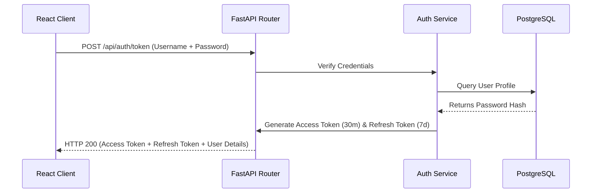
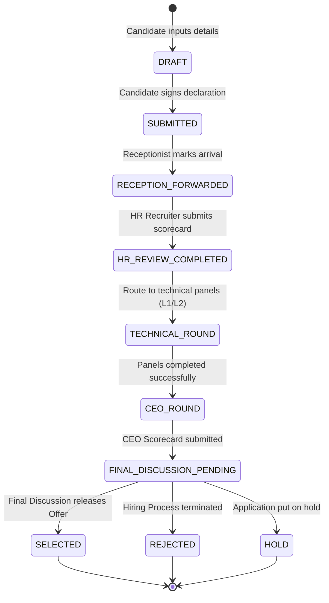
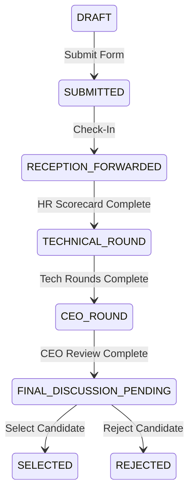
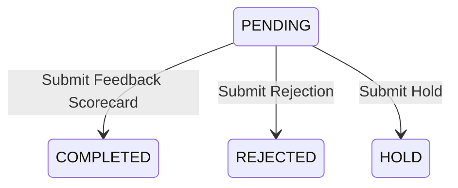

# ATLAS HR RECRUITMENT MANAGEMENT SYSTEM
## Backend Architecture & API Specification Document

This document serves as the definitive, single source of truth for the backend architecture of the **Atlas HR Recruitment Management System (Atlas ATS)**. It is designed to enable a frontend generator AI (such as Lovable) to reconstruct the complete React client application from scratch without requiring access to the backend source code.

---

## 1. Project Overview
The Atlas HR Recruitment Management System is an enterprise-grade Applicant Tracking System (ATS) designed to streamline multi-stage hiring processes. The platform handles candidate registration, reception check-in, recruiter HR screenings, L1/L2 panel technical evaluations, CEO feedback assessments, final panel discussions, and offer releases under strict Role-Based Access Control (RBAC).

### Technology Stack:
*   **Backend**: Python 3.12, FastAPI, SQLAlchemy (v2.0 style), Alembic (migrations), PostgreSQL, JWT (Authentication), Passlib (security).
*   **Frontend**: React 19, Material UI (v9), React Router, React Hook Form, Axios, Recharts, Vite.
*   **Infrastructure**: Docker, Nginx, Docker Compose.

### Key Workflows:
*   **Candidate Self-Registration**: Public multi-step wizard.
*   **Reception Check-In**: Mark applicant physical/virtual arrival.
*   **HR Screening Review**: Evaluate 7 primary behavioral dimensions and assign module routing.
*   **Multi-Round Technical Panel Evaluation**: Structured L1, L2, and Tech Head evaluations.
*   **CEO Evaluation**: High-level leadership assessment.
*   **Final Discussion Panel**: Collaborative HR and Management reviews.
*   **Offer Selection / Rejection**: Status transitions to SELECTED, REJECTED, or HOLD.

---

## 2. Complete Folder Structure

Below is the directory tree of the project. Frontend developers and automation systems must treat all backend, database, and infrastructure configurations as **immutable**.

```
C:/Users/dhruv/Desktop/Atlas_HR_project-main/
├── backend/
│   ├── alembic/                  # Database migration configuration scripts
│   ├── core/                     # Configuration settings and security variables
│   ├── database/                 # SQLAlchemy engine, session handlers, and seed scripts
│   │   ├── connection.py         # DB connection setup and get_db dependencies
│   │   └── seed.py               # Initial seed data for system roles, permissions, and admin accounts
│   ├── middleware/               # HTTP middleware (CORS, Rate Limiting, Role Authorization)
│   │   ├── auth.py               # JWT verification and user authentication context injection
│   │   └── role_auth.py          # Route-level permissions validation
│   ├── models/                   # SQLAlchemy database models mapping to PostgreSQL
│   │   ├── applicant.py          # Candidate profiles, employment history, education, rounds, logs
│   │   ├── permission.py         # Permission lookup table definition
│   │   ├── role.py               # Role definition schema
│   │   └── user.py               # User and staff profile definitions
│   ├── routes/                   # FastAPI route endpoints
│   │   ├── applicant.py          # Candidate roster, details retrieval, profile modifications
│   │   ├── auth.py               # Sign-in, session refresh, token validations
│   │   ├── scorecard.py          # Performance metrics evaluations
│   │   ├── user.py               # Recruiter and panel management rosters
│   │   └── workflow.py           # Reception check-in, HR reviews, technical panel scorecards
│   ├── schemas/                  # Pydantic data schemas for request/response serialization
│   │   ├── applicant.py          # Candidate forms validations
│   │   ├── auth.py               # Login payloads structures
│   │   ├── user.py               # Recruiter profile validations
│   │   └── workflow.py           # Scorecards and status transitions payloads
│   ├── services/                 # Business logic and database operations
│   │   ├── applicant_service.py  # Profile CRUD and file upload operations
│   │   ├── auth_service.py       # JWT creation, validation, and user credentials resolution
│   │   └── workflow_service.py   # Multi-stage routing state-machine operations
│   ├── tests/                    # Pytest integration tests suites
│   ├── uploads/                  # Local storage path for uploaded candidate resume/signatures
│   ├── Dockerfile                # Docker build steps for FastAPI server container
│   ├── alembic.ini               # Alembic configuration variables
│   ├── app.py                    # Root entrypoint for FastAPI application
│   ├── requirements.txt          # Python dependencies definitions
│   └── docker-entrypoint.sh      # Container entrypoint startup script
│
├── frontend/                     # React Single Page Application (Vite project)
│   ├── src/
│   │   ├── assets/               # Branding logotypes and corporate illustrations
│   │   ├── components/           # Reusable presentational elements
│   │   │   ├── common/           # Shared pills, chips, layouts, headers
│   │   │   └── dashboard/        # Role-specific queue tables, timelines, metrics
│   │   ├── contexts/             # Global contexts (AuthContext, NotificationContext)
│   │   ├── hooks/                # Custom React hooks (useAuth, useNotification)
│   │   ├── layouts/              # App shells (DashboardLayout wrapping sidebar & navigation)
│   │   ├── pages/                # Primary routing pages (Login, Forms, Dashboards)
│   │   ├── routes/               # AppRoutes mapping, ProtectedRoute, RequirePermission guards
│   │   └── theme/                # Custom MUI theme (theme.js)
│   ├── package.json              # NPM dependencies definitions
│   └── vite.config.js            # Vite build configuration settings
│
└── docker-compose.yml            # Complete infrastructure compose definitions
```

---

## 3. Overall Architecture



### Key Subsystems:
1.  **Authentication & Session Subsystem**: JWT Access token validation (expiry 30m) and refresh token handler (expiry 7d). Tokens are transmitted via JSON payload and stored locally in the React state/session storage.
2.  **Workflow State-Machine**: Progresses candidates across status values: `DRAFT` ➔ `SUBMITTED` ➔ `RECEPTION_FORWARDED` ➔ `TECHNICAL_ROUND` ➔ `CEO_ROUND` ➔ `FINAL_DISCUSSION_PENDING` ➔ `SELECTED`/`REJECTED`/`HOLD`.
3.  **File Management Subsystem**: Saves PDF resumes and signature images locally in the `/app/uploads` path and tracks their relative URIs in the database table `candidate_documents`.

---

## 4. Backend Folder Analysis

### 4.1. Core Configuration & dependencies
*   `app.py`: Initialises FastAPI core, mounts CORS policies supporting frontend origin, registers sub-routers, hooks global exception handlers, and configures the `/api/uploads` static resource mount.
*   `utils/permissions.py`: Defines the dictionary mapping permission strings to human-readable summaries.

### 4.2. Routing Subsystem
*   `routes/auth.py`: Handles token generation, logins, and refresh lookups.
*   `routes/applicant.py`: Governs list querying, detail retrieval, candidate registers, and file attachments.
*   `routes/workflow.py`: Manages receptionist forwards, scorecard submissions, and offer statuses.

### 4.3. Business Services Subsystem
*   `services/auth_service.py`: Resolves DB user verification and token signatures.
*   `services/applicant_service.py`: Generates unique application numbers (`ATLAS-APP-YYYYMMDD-XXXX`) and manages CRUD persistence.
*   `services/workflow_service.py`: Governs interview step routing and transition checks.

---

## 5. Database Documentation

### 5.1. Table: `roles`
Stores system RBAC roles.
*   `role_id`: `UUID` (Primary Key, default: `gen_random_uuid()`)
*   `name`: `VARCHAR(50)` (Unique, Indexed, e.g., `SYSTEM_ADMIN`, `HR_ADMIN`, `RECEPTIONIST`, `L1_PANEL`, `L2_PANEL`, `TECH_HEAD`, `CEO`)
*   `description`: `TEXT`

### 5.2. Table: `permissions`
Stores fine-grained permissions.
*   `permission_id`: `UUID` (Primary Key)
*   `name`: `VARCHAR(100)` (Unique, Indexed, e.g., `candidate.list`, `workflow.reception_forward`, `user.manage`)
*   `description`: `TEXT`

### 5.3. Table: `role_permissions`
Join table mapping permissions to roles.
*   `role_id`: `UUID` (Foreign Key -> `roles.role_id`, Cascade Delete)
*   `permission_id`: `UUID` (Foreign Key -> `permissions.permission_id`, Cascade Delete)

### 5.4. Table: `users`
Contains staff credentials and profiles.
*   `user_id`: `UUID` (Primary Key)
*   `email`: `VARCHAR(100)` (Unique, Indexed, Non-Nullable)
*   `password_hash`: `VARCHAR(255)` (Non-Nullable)
*   `first_name`: `VARCHAR(50)`
*   `last_name`: `VARCHAR(50)`
*   `is_active`: `BOOLEAN` (Default: `TRUE`)
*   `created_at`: `TIMESTAMP WITH TIME ZONE`
*   `updated_at`: `TIMESTAMP WITH TIME ZONE`

### 5.5. Table: `user_roles`
Join table mapping users to roles.
*   `user_id`: `UUID` (Foreign Key -> `users.user_id`, Cascade Delete)
*   `role_id`: `UUID` (Foreign Key -> `roles.role_id`, Cascade Delete)

### 5.6. Table: `candidates`
The core applicant profile database containing personal details and progress statuses.
*   `candidate_id`: `UUID` (Primary Key)
*   `application_number`: `VARCHAR(30)` (Unique, Indexed, e.g., `ATLAS-APP-20260711-0001`)
*   `first_name`: `VARCHAR(50)` (Non-Nullable)
*   `middle_name`: `VARCHAR(50)`
*   `last_name`: `VARCHAR(50)` (Non-Nullable)
*   `email`: `VARCHAR(100)` (Unique, Indexed, Non-Nullable)
*   `phone`: `VARCHAR(15)` (Non-Nullable)
*   `gender`: `VARCHAR(10)`
*   `date_of_birth`: `DATE`
*   `current_address`: `TEXT`
*   `permanent_address`: `TEXT`
*   `city`: `VARCHAR(50)`
*   `state`: `VARCHAR(50)`
*   `country`: `VARCHAR(50)`
*   `pincode`: `VARCHAR(10)`
*   `status`: `VARCHAR(50)` (Default: `DRAFT`, Indexed, e.g., `DRAFT`, `SUBMITTED`, `RECEPTION_FORWARDED`, `TECHNICAL_ROUND`, `CEO_ROUND`, `FINAL_DISCUSSION_PENDING`, `SELECTED`, `REJECTED`, `HOLD`)
*   `domain`: `VARCHAR(100)` (e.g. `SD`, `MM`, `FI`)
*   `total_rounds`: `INTEGER` (Total technical interview rounds configured by HR)
*   `position_applied_for`: `VARCHAR(100)`
*   `referred_by`: `VARCHAR(100)`
*   `reference_number`: `VARCHAR(50)`
*   `created_at`: `TIMESTAMP WITH TIME ZONE`
*   `updated_at`: `TIMESTAMP WITH TIME ZONE`

### 5.7. Table: `applicant_professional_details`
Candidate salary and notice configurations.
*   `detail_id`: `UUID` (Primary Key)
*   `candidate_id`: `UUID` (Foreign Key -> `candidates.candidate_id`, Unique, Cascade Delete)
*   `total_experience`: `NUMERIC(4,2)`
*   `relevant_experience`: `NUMERIC(4,2)`
*   `current_company`: `VARCHAR(100)`
*   `current_designation`: `VARCHAR(100)`
*   `current_ctc`: `NUMERIC(10,2)`
*   `expected_ctc`: `NUMERIC(10,2)`
*   `notice_period`: `VARCHAR(50)`
*   `joining_availability`: `VARCHAR(100)`
*   `preferred_location`: `VARCHAR(100)`
*   `employment_type`: `VARCHAR(50)`

### 5.8. Table: `applicant_employment_history`
Detailed historical job profiles.
*   `history_id`: `UUID` (Primary Key)
*   `candidate_id`: `UUID` (Foreign Key -> `candidates.candidate_id`, Cascade Delete)
*   `company_name`: `VARCHAR(100)`
*   `designation`: `VARCHAR(100)`
*   `start_date`: `VARCHAR(30)`
*   `end_date`: `VARCHAR(30)`
*   `responsibilities`: `TEXT`
*   `reason_for_leaving`: `TEXT`

### 5.9. Table: `applicant_education`
Qualifications records.
*   `education_id`: `UUID` (Primary Key)
*   `candidate_id`: `UUID` (Foreign Key -> `candidates.candidate_id`, Cascade Delete)
*   `qualification`: `VARCHAR(100)`
*   `specialization`: `VARCHAR(100)`
*   `institution_name`: `VARCHAR(150)`
*   `university`: `VARCHAR(150)`
*   `passing_year`: `INTEGER`
*   `percentage`: `NUMERIC(5,2)`
*   `grade`: `VARCHAR(10)`

### 5.10. Table: `candidate_documents`
Tracks attached PDF resumes, signature clips, and reference files.
*   `document_id`: `UUID` (Primary Key)
*   `candidate_id`: `UUID` (Foreign Key -> `candidates.candidate_id`, Cascade Delete)
*   `document_type`: `VARCHAR(50)` (e.g. `RESUME_PDF`, `SIGNATURE_PDF`)
*   `file_path`: `TEXT` (Non-Nullable)
*   `uploaded_at`: `TIMESTAMP WITH TIME ZONE`

### 5.11. Table: `interview_rounds`
The primary panel feedback database mapping multi-stage evaluations.
*   `round_id`: `UUID` (Primary Key)
*   `candidate_id`: `UUID` (Foreign Key -> `candidates.candidate_id`, Cascade Delete)
*   `round_number`: `INTEGER` (e.g. 1, 2)
*   `round_type`: `VARCHAR(50)` (e.g. `HR_REVIEW`, `TECHNICAL_ROUND`, `CEO_ROUND`, `FINAL_DISCUSSION`)
*   `interviewer_email`: `VARCHAR(100)` (Non-Nullable)
*   `evaluation_data`: `JSONB` (Stores multi-dimension score rating metrics & behavioral comments)
*   `status`: `VARCHAR(30)` (e.g. `PENDING`, `COMPLETED`, `REJECTED`, `HOLD`)
*   `completed_at`: `TIMESTAMP WITH TIME ZONE`

### 5.12. Table: `candidate_activity_logs`
Chronological audit logs of application status changes.
*   `log_id`: `UUID` (Primary Key)
*   `candidate_id`: `UUID` (Foreign Key -> `candidates.candidate_id`, Cascade Delete)
*   `user_email`: `VARCHAR(100)`
*   `action`: `VARCHAR(100)`
*   `details`: `TEXT`
*   `created_at`: `TIMESTAMP WITH TIME ZONE`

---

## 6. Entity Relationship Diagram



---

## 7. Authentication

Authentication uses standard OAuth2 Password Bearer flow returning JWT Access Tokens and database-verifiable Refresh Tokens.



*   **Access Token Structure**: JWT payload containing `sub` (User Email), `exp` (Expiry Epoch), and `scopes` (User Permissions list).
*   **Refresh Flow**: Client posts refresh token to `/api/auth/refresh`. Response yields a fresh access token without requiring re-authentication.

---

## 8. Role Based Access Control (RBAC)

RBAC matches permission tokens parsed in JWT token claims.

| Role | Core Permissions | Target Pages & Dashboards |
| :--- | :--- | :--- |
| **SYSTEM_ADMIN** | `user.manage`, `candidate.list` | Full Users Panel, Candidate Pipeline, System Logs. |
| **HR_ADMIN** | `candidate.list`, `workflow.hr_review`, `candidate.create`, `candidate.update` | HR Review Dashboard, Candidate registration, Candidate drawer details. |
| **RECEPTIONIST** | `workflow.reception_forward`, `candidate.create` | Reception Queue Dashboard, self-registration links generator. |
| **L1_PANEL** | `workflow.technical_evaluate`, `evaluation.view_assigned` | Interviewer Queue, Technical Evaluation Scorecards. |
| **L2_PANEL** | `workflow.technical_evaluate`, `evaluation.view_assigned` | Interviewer Queue, Technical Evaluation Scorecards. |
| **TECH_HEAD** | `evaluation.view_all` | Candidate reviews pipeline, detail scorecards. |
| **CEO** | `evaluation.view_all`, `decision.final` | CEO evaluation queue, Final Panel workspace, Final decision release. |

---

## 9. Complete Candidate Workflow



---

## 10. API Documentation

### 10.1. Authentication Router (`/api/auth`)

#### POST `/api/auth/token`
Generate access token using credentials.
*   **Request Type**: `application/x-www-form-urlencoded`
*   **Payload**:
    ```ini
    username=admin@atlas.com
    password=adminpassword
    ```
*   **Response (200 OK)**:
    ```json
    {
      "access_token": "eyJhbGciOi...",
      "token_type": "bearer",
      "refresh_token": "refresh_token_uuid",
      "user": {
        "user_id": "9b1deb4d-3b7d-4bad-9bdd-2b0d7b3dcb6d",
        "email": "admin@atlas.com",
        "first_name": "Atlas",
        "last_name": "Admin",
        "roles": ["SYSTEM_ADMIN"],
        "permissions": ["user.manage", "candidate.list"]
      }
    }
    ```

#### POST `/api/auth/refresh`
Refresh expired access token.
*   **Request Body (JSON)**:
    ```json
    {
      "refresh_token": "refresh_token_uuid"
    }
    ```
*   **Response (200 OK)**:
    ```json
    {
      "access_token": "eyJhbGciOi...",
      "token_type": "bearer"
    }
    ```

---

### 10.2. Applicant Router (`/api/applicants`)

#### GET `/api/applicants`
Fetch candidates filtered by status.
*   **Permissions**: `candidate.list` or `workflow.reception_forward`
*   **Query Parameters**:
    *   `status`: Filter by candidate status (e.g. `RECEPTION_FORWARDED`, `SELECTED`)
    *   `limit`: Pagination record count limit (default: 100)
*   **Response (200 OK)**:
    ```json
    {
      "success": true,
      "applicants": [
        {
          "candidate_id": "4a1deb4d-3b7d-4bad-9bdd-2b0d7b3dcb6d",
          "application_number": "ATLAS-APP-20260711-0001",
          "first_name": "Dhruv",
          "last_name": "Sharma",
          "email": "dhruv.sharma@gmail.com",
          "phone": "9876543210",
          "status": "RECEPTION_FORWARDED",
          "position_applied_for": "SAP ABAP Consultant",
          "created_at": "2026-07-11T12:00:00Z",
          "updated_at": "2026-07-11T12:05:00Z"
        }
      ]
    }
    ```

#### GET `/api/applicants/{id}`
Fetch detailed candidate dossier (including education, experience, perspective, and scorecard reviews history).
*   **Response (200 OK)**:
    ```json
    {
      "success": true,
      "data": {
        "candidate_id": "4a1deb4d-3b7d-4bad-9bdd-2b0d7b3dcb6d",
        "application_number": "ATLAS-APP-20260711-0001",
        "first_name": "Dhruv",
        "last_name": "Sharma",
        "email": "dhruv.sharma@gmail.com",
        "phone": "9876543210",
        "gender": "MALE",
        "date_of_birth": "1998-05-15",
        "current_address": "MG Road, Bangalore",
        "city": "Bangalore",
        "state": "Karnataka",
        "country": "India",
        "pincode": "560001",
        "status": "RECEPTION_FORWARDED",
        "position_applied_for": "SAP ABAP Consultant",
        "professional_details": {
          "total_experience": 4.5,
          "relevant_experience": 3.0,
          "current_company": "Accenture",
          "current_designation": "Software Engineer",
          "current_ctc": 8.5,
          "expected_ctc": 12.0,
          "notice_period": "30 Days",
          "joining_availability": "Immediate",
          "preferred_location": "Bangalore"
        },
        "education": [
          {
            "qualification": "B.Tech",
            "specialization": "Computer Science",
            "institution_name": "VIT University",
            "university": "VIT",
            "passing_year": 2020,
            "percentage": 82.5
          }
        ],
        "employment_history": [
          {
            "company_name": "Infosys",
            "designation": "Systems Engineer",
            "start_date": "2020-07-01",
            "end_date": "2022-08-31",
            "responsibilities": "Developed ABAP reports"
          }
        ],
        "personality_assessment": [
          { "question_number": 1, "rating": 4 }
        ],
        "situational_responses": [
          { "question_number": 1, "selected_option": "B" }
        ],
        "written_responses": [
          { "question_number": 1, "answer_text": "Taking responsibility means..." }
        ],
        "documents": [
          { "document_id": "doc1", "document_type": "RESUME_PDF", "file_path": "/uploads/resume_1.pdf" }
        ],
        "interview_rounds": [
          {
            "round_id": "r1",
            "round_number": 1,
            "round_type": "HR_REVIEW",
            "interviewer_email": "hr@atlas.com",
            "status": "COMPLETED",
            "evaluation_data": {
              "Communication & Articulation": { "rating": 4, "remarks": "Very clear speaker" }
            }
          }
        ]
      }
    }
    ```

#### POST `/api/applicants/register`
Submit candidate registration profile.
*   **Request Body (JSON)**:
    ```json
    {
      "first_name": "Dhruv",
      "last_name": "Sharma",
      "email": "dhruv.sharma@gmail.com",
      "phone": "9876543210",
      "gender": "MALE",
      "date_of_birth": "1998-05-15",
      "current_address": "MG Road, Bangalore",
      "city": "Bangalore",
      "state": "Karnataka",
      "country": "India",
      "pincode": "560001",
      "position_applied_for": "SAP ABAP Consultant",
      "professional_details": {
        "total_experience": 4.5,
        "relevant_experience": 3.0,
        "current_company": "Accenture",
        "current_designation": "Software Engineer",
        "current_ctc": 8.5,
        "expected_ctc": 12.0,
        "notice_period": "30 Days",
        "joining_availability": "Immediate",
        "preferred_location": "Bangalore"
      },
      "education": [
        {
          "qualification": "B.Tech",
          "specialization": "Computer Science",
          "institution_name": "VIT University",
          "university": "VIT",
          "passing_year": 2020,
          "percentage": 82.5
        }
      ],
      "employment_history": [
        {
          "company_name": "Infosys",
          "designation": "Systems Engineer",
          "start_date": "2020-07-01",
          "end_date": "2022-08-31",
          "responsibilities": "Developed ABAP reports"
        }
      ],
      "personality_answers": [
        { "question_number": 1, "rating": 4 }
      ],
      "situational_answers": [
        { "question_number": 1, "selected_option": "B" }
      ],
      "written_answers": [
        { "question_number": 1, "answer_text": "Taking responsibility means..." }
      ],
      "declaration_accepted": true,
      "consent_accepted": true
    }
    ```
*   **Response (200 OK)**:
    ```json
    {
      "success": true,
      "message": "Candidate profile registered successfully.",
      "candidate_id": "4a1deb4d-3b7d-4bad-9bdd-2b0d7b3dcb6d",
      "application_number": "ATLAS-APP-20260711-0001"
    }
    ```

#### POST `/api/applicants/{id}/upload-document`
Upload candidate PDF files (e.g. resumes, signature forms).
*   **Request Type**: `multipart/form-data`
*   **Query Parameters**:
    *   `document_type`: Must be `RESUME_PDF` or `SIGNATURE_PDF`
*   **Payload**:
    *   `file`: (Binary File Stream)
*   **Response (200 OK)**:
    ```json
    {
      "success": true,
      "message": "Document uploaded successfully",
      "file_path": "/uploads/4a1deb4d_resume.pdf"
    }
    ```

---

### 10.3. Workflow Router (`/api/workflow`)

#### POST `/api/workflow/receptionist/forward/{candidate_id}`
Receptionist check-in action forwarding candidates to HR screening.
*   **Permissions**: `workflow.reception_forward`
*   **Response (200 OK)**:
    ```json
    {
      "success": true,
      "message": "Candidate forwarded to HR successfully",
      "data": {
        "candidate_id": "4a1deb4d-3b7d-4bad-9bdd-2b0d7b3dcb6d",
        "status": "RECEPTION_FORWARDED"
      }
    }
    ```

#### POST `/api/workflow/hr/review/{candidate_id}`
Submit initial HR screening assessment scorecard.
*   **Permissions**: `workflow.hr_review`
*   **Request Body (JSON)**:
    ```json
    {
      "domain": "SD",
      "number_of_tech_rounds": 2,
      "hr_status": "SELECT",
      "first_interviewer_email": "tech1@atlas.com",
      "evaluation_data": {
        "Communication & Articulation": { "rating": 4, "remarks": "Very articulate" },
        "Confidence & Poise": { "rating": 4, "remarks": "Polished presentation" },
        "Technical / Domain Knowledge": { "rating": 3, "remarks": "Good basics" },
        "Attitude & Ownership Mindset": { "rating": 4, "remarks": "Strong mindset" },
        "Empathy & Team Orientation": { "rating": 4, "remarks": "Collaborative" },
        "Problem-Solving Approach": { "rating": 3, "remarks": "Methodical" },
        "Cultural Fit & Values Alignment": { "rating": 4, "remarks": "Matches values" }
      }
    }
    ```
*   **Response (200 OK)**:
    ```json
    {
      "success": true,
      "message": "HR Review submitted successfully. Candidate routed to technical rounds.",
      "data": {
        "candidate_id": "4a1deb4d-3b7d-4bad-9bdd-2b0d7b3dcb6d",
        "status": "TECHNICAL_ROUND"
      }
    }
    ```

#### POST `/api/workflow/interviewer/evaluate/{candidate_id}`
Submit technical scorecard evaluation (Round L1, L2, etc.).
*   **Permissions**: `workflow.technical_evaluate`
*   **Request Body (JSON)**:
    ```json
    {
      "round_number": 1,
      "interviewer_status": "SELECT",
      "next_interviewer_email": "tech2@atlas.com",
      "remarks": "Passed round 1. Proceeding to round 2.",
      "evaluation_data": {
        "Core Technical Competency": { "rating": 4, "remarks": "Understands architecture well" }
      }
    }
    ```
*   **Response (200 OK)**:
    ```json
    {
      "success": true,
      "message": "Technical review submitted successfully.",
      "data": {
        "candidate_id": "4a1deb4d-3b7d-4bad-9bdd-2b0d7b3dcb6d",
        "status": "TECHNICAL_ROUND"
      }
    }
    ```

#### POST `/api/workflow/ceo/evaluate/{candidate_id}`
Submit CEO round evaluation feedback.
*   **Permissions**: `workflow.technical_evaluate` (or CEO specific evaluation permissions)
*   **Request Body (JSON)**:
    ```json
    {
      "interviewer_status": "SELECT",
      "remarks": "Recommended for final discussion round.",
      "evaluation_data": {
        "Leadership Aptitude": { "rating": 4, "remarks": "Clear vision" }
      }
    }
    ```
*   **Response (200 OK)**:
    ```json
    {
      "success": true,
      "message": "CEO Evaluation submitted successfully.",
      "data": {
        "candidate_id": "4a1deb4d-3b7d-4bad-9bdd-2b0d7b3dcb6d",
        "status": "FINAL_DISCUSSION_PENDING"
      }
    }
    ```

#### POST `/api/workflow/admin/final-decision/{candidate_id}`
Submit final offer selection/rejection decision.
*   **Permissions**: `decision.final`
*   **Request Body (JSON)**:
    ```json
    {
      "decision_status": "SELECTED",
      "joining_date": "2026-08-01",
      "offered_ctc": 12.5,
      "hr_remarks": "Offer letter released.",
      "ceo_remarks": "Approved by CEO."
    }
    ```
*   **Response (200 OK)**:
    ```json
    {
      "success": true,
      "message": "Final decision submitted successfully.",
      "data": {
        "candidate_id": "4a1deb4d-3b7d-4bad-9bdd-2b0d7b3dcb6d",
        "status": "SELECTED"
      }
    }
    ```

---

## 11. Dashboard Documentation

### 11.1. Receptionist Dashboard
*   **Welcome Area**: Greetings banner showing "Good Morning, Reception 👋", current date, and counts for candidate applications, checked-in cards, and interview queue.
*   **Pending check-in queue**: Shows candidates in `SUBMITTED` status. Actions: "Mark as Arrived" (calls `/receptionist/forward/{candidate_id}`).
*   **Arrived Today queue**: Shows candidates marked as arrived today (`candidate.updated_at` is today and status is `RECEPTION_FORWARDED` or subsequent stages).
*   **Self-Registration link**: Copies the registration URL `http://origin/register-candidate` to clipboard.

### 11.2. HR Review Dashboard
*   **KPI Section**: Cards representing: Awaiting HR Review, Screenings Passed, Recruiter Profiles, and screening speed metrics.
*   **Pending screenings table**: Lists candidates with status `RECEPTION_FORWARDED`.
*   **Roster actions**: "Review" button redirects to `/hr/review/{id}` workspace. Row click opens Candidate Details Drawer.

### 11.3. Technical Panel Dashboard
*   **Roster queue**: Lists candidate interviews assigned to the logged-in interviewer (matching `interviewer_email` inside active `interview_rounds`).
*   **Actions**: "Evaluate" redirects to evaluation form workspace.

### 11.4. CEO Evaluation Queue
*   **Status filter**: Tracks candidates currently routed to `CEO_ROUND`.
*   **Actions**: "Submit Scorecard" opens evaluation dialog scorecard.

### 11.5. Final Decision Dashboard
*   **Roster queue**: Tracks candidates in `FINAL_DISCUSSION_PENDING` status.
*   **Actions**: "Final Decision" redirects to offer release workspace.

---

## 12. Candidate Registration (Step-by-Step Form)

The candidate registration form features 8 steps with progress bars:

1.  **Personal Information**: Names, email, phone, gender, current address, city, state, country, pincode.
2.  **Professional Details**: Experience summaries (total, relevant), notice period, current company, designation, current/expected CTC, preferred location, joining availability.
3.  **Employment History**: Grid form allowing multiple job items (Company name, designation, start/end dates, responsibilities, reason for leaving).
4.  **Education**: Grid form allowing multiple qualification rows (B.Tech, institution, specialization, year, percentage).
5.  **Personality Assessment**: 18 Likert-scale self-ratings (Values 1 to 5).
6.  **Situational Questions**: 5 workplace scenario multiple-choice questions.
7.  **Written Responses**: 5 descriptive text boxes.
8.  **Declaration**: Acceptance of declaration/consent, date, and digital signature upload.

---

## 13. Interview Process Specifications

```mermaid
graph LR
    SUB[Submitted Application] -->|Receptionist Check-In| REC[Reception Forwarded]
    REC -->|HR Review Form Complete| HR[HR Selected / Domain Assigned]
    HR -->|First Interviewer Assigned| T1[Technical Round 1]
    T1 -->|Submit Scorecard SELECT| T2[Technical Round 2]
    T2 -->|Submit Scorecard SELECT| CEO[CEO Evaluation]
    CEO -->|Submit Scorecard SELECT| FD[Final Discussion]
    FD -->|Submit Final Decision SELECTED| SEL[Selected / Offer Released]
```



---

## 14. Final Discussion Module

The Final Discussion module aggregates reviews from all completed rounds (HR ratings, L1 scorecard, L2 feedback, and CEO comments) and offers decision controls:
*   **Read-Only scorecards**: A tabbed comparison layout showcasing panel comments.
*   **Decision status selection**: Select either `SELECTED` (Offer Release), `REJECTED`, or `HOLD`.
*   **Offer Parameters**: Input joining date, final offered CTC (LPA), and custom remarks.

---

## 15. Frontend API Mapping

| Frontend Component / Page | Action | API Method & Route | Related DB Tables |
| :--- | :--- | :--- | :--- |
| `Login.jsx` | Authenticate | `POST /api/auth/token` | `users`, `roles` |
| `Login.jsx` | Refresh token | `POST /api/auth/refresh` | `users` |
| `CandidateForm.jsx` | Register candidate | `POST /api/applicants/register` | `candidates`, `applicant_professional_details`, `applicant_employment_history`, `applicant_education` |
| `CandidateForm.jsx` | Upload PDF Resume | `POST /api/applicants/{id}/upload-document` | `candidate_documents` |
| `ReceptionQueueWidget.jsx` | Roster list | `GET /api/applicants?limit=100` | `candidates` |
| `ReceptionQueueWidget.jsx` | Forward candidate | `POST /api/workflow/receptionist/forward/{id}` | `candidates`, `candidate_activity_logs` |
| `HrReviewQueueWidget.jsx` | Roster list | `GET /api/applicants?status=RECEPTION_FORWARDED` | `candidates` |
| `HrReviewForm.jsx` | Submit HR review | `POST /api/workflow/hr/review/{id}` | `candidates`, `interview_rounds`, `candidate_activity_logs` |
| `InterviewerEvalForm.jsx` | Submit scorecard | `POST /api/workflow/interviewer/evaluate/{id}` | `candidates`, `interview_rounds`, `candidate_activity_logs` |
| `FinalDecisionPage.jsx` | Submit decision | `POST /api/workflow/admin/final-decision/{id}` | `candidates`, `candidate_activity_logs` |

---

## 16. UI Component Mapping

### 16.1. Route: `/login`
*   **React Component**: `Login.jsx`
*   **Displayed Data**: Sign-in input fields (Email, password), and split-screen branding experience.
*   **Actions**: Calls `/api/auth/token` on submit. Saves JWT tokens in state context.

### 16.2. Route: `/dashboard`
*   **React Component**: `Dashboard.jsx`
*   **Displayed Widgets**: Automatically renders widgets based on permission scopes (e.g. `HrReviewQueueWidget`, `ReceptionQueueWidget`, `InterviewerQueueWidget`, `FinalDecisionWidget`).

### 16.3. Route: `/candidates`
*   **React Component**: `EditCandidatesList.jsx`
*   **Displayed Data**: Full roster list of registered candidate records.
*   **Actions**: "Edit" navigation targets `/register-candidate?edit={id}`.

### 16.4. Route: `/hr/review/:id`
*   **React Component**: `HrReviewForm.jsx`
*   **Displayed Data**: Three-column workspace showing candidate profile, evaluation scorecards, and timeline.
*   **Actions**: Submits evaluation payload via `/api/workflow/hr/review/{id}`.

---

## 17. Error Handling & Resiliency

*   **HTTP 401 Unauthorized**: Handled by Axios response interceptors. If an expired token is detected, it intercepts the request, attempts to refresh token via `POST /api/auth/refresh`, and retries the original request. If refresh fails, it clears authentication contexts and redirects to `/login`.
*   **HTTP 422 Unprocessable Entity**: Raised when requests fail schema validation. Response details highlight missing/invalid fields.
*   **HTTP 429 Too Many Requests**: Raised by rate-limiting filters (SlowAPI). The client should render toast notifications advising the user to slow down.

---

## 18. Docker Infrastructure

```yaml
version: '3.8'

services:
  db:
    image: postgres:15-alpine
    container_name: atlas_postgres_db
    ports:
      - "5432:5432"
    environment:
      POSTGRES_DB: recruitment_db
      POSTGRES_USER: postgres
      POSTGRES_PASSWORD: securedbpassword
    volumes:
      - pgdata:/var/lib/postgresql/data

  backend:
    build: ./backend
    container_name: atlas_fastapi_backend
    ports:
      - "8000:8000"
    environment:
      DATABASE_URL: postgresql://postgres:securedbpassword@db:5432/recruitment_db
      JWT_SECRET: supersecretjwtkeykeys
    depends_on:
      - db

  frontend:
    build: ./frontend
    container_name: atlas_nginx_frontend
    ports:
      - "80:80"
    depends_on:
      - backend
```

---

## 19. Environment Variables

*   **`DATABASE_URL`**: DB Connection URL string (e.g. `postgresql://postgres:securedb@db:5432/db_name`).
*   **`JWT_SECRET`**: Private signing key used for token generations.
*   **`ALEMBIC_DATABASE_URL`**: Migration connection override string (fallback matches `DATABASE_URL` if empty).

---

## 20. Testing & Verifications

*   **Pytest Integration Suite**: The testing suite includes:
    *   `tests/test_applicant_api.py`: Validates registration constraints, field sizes, and document attachment streams.
    *   `tests/test_user_api.py`: Validates user authentication, role assignment, and access controls.
    *   `tests/test_workflow.py`: Asserts step-by-step state changes and database updates.
*   **Vite Compiler checks**: Ran `npm run build` to verify frontend compiling is successful.

---

## 21. API Dependency Matrix

| Frontend Component | Target API | Modification Impact |
| :--- | :--- | :--- |
| `CandidateForm.jsx` | `POST /api/applicants/register` | Writes to tables: `candidates`, `applicant_professional_details`, `applicant_education` |
| `ReceptionQueueWidget.jsx` | `POST /api/workflow/receptionist/forward/{id}` | Updates `candidates.status` to `RECEPTION_FORWARDED` |
| `HrReviewForm.jsx` | `POST /api/workflow/hr/review/{id}` | Updates `candidates.status` to `TECHNICAL_ROUND` and writes `interview_rounds` |
| `FinalDecisionPage.jsx` | `POST /api/workflow/admin/final-decision/{id}` | Updates `candidates.status` to `SELECTED` / `REJECTED` |

---

## 22. State Machine Diagrams

### 22.1. Candidate Status Transitions


### 22.2. Interview Round Status Transitions


---

## 23. Frontend Redesign Guidelines (For Lovable AI)

### 23.1. Customizable Styling & UI Areas:
*   **Color Systems & Layouts**: Feel free to use modern components (e.g. rounded border containers, translucent cards, and smooth navigation animations).
*   **Tables and Statistics Grid**: Customize tables with pagination, sorting filters, priority badges, and status pills.
*   **Micro Interactions**: Incorporate hover transitions, button ripples, and dialog fade entries.

### 23.2. Non-Redesignable Components:
*   **API Routes & Payloads**: All endpoint URLs, query keys, request JSON shapes, and response serialization structures must remain **untouched**.
*   **Authentication & Session Storage**: Access token and refresh token storage and refresh logic are immutable.
*   **State Machine Codes**: The status strings (e.g. `DRAFT`, `SUBMITTED`, `RECEPTION_FORWARDED`, `TECHNICAL_ROUND`, `SELECTED`) are matched exactly by the backend workflow engine and database schemas and must not be renamed.

---

## 24. NON-NEGOTIABLE BACKEND CONTRACTS
The client application must strictly conform to these backend parameters. **Do not modify any of the following**:
1.  **Authentication Scheme**: Standard Bearer Token authorization header (`Authorization: Bearer <token>`).
2.  **Registration Validation Payload**: Submitting registration must exactly match the `POST /api/applicants/register` JSON structure, including sub-objects `professional_details`, `education`, and `employment_history`.
3.  **Scorecard Evaluation Structure**: HR screening scorecard submissions must match the exact dictionary structure for the 7 primary dimensions under key `evaluation_data`.
4.  **Workflow Status Identifiers**: State machine values (`DRAFT`, `SUBMITTED`, `RECEPTION_FORWARDED`, `TECHNICAL_ROUND`, `CEO_ROUND`, `FINAL_DISCUSSION_PENDING`, `SELECTED`, `REJECTED`, `HOLD`) are hardcoded in the database constraints and validation layers. Changing these will break the application flow.

---

## 25. FRONTEND AI IMPLEMENTATION GUIDE
This section outlines integration guidelines for frontend generator tools like Lovable:
*   **API Client Setup**: Use Axios with default configuration. Inject the JWT token dynamically into the `Authorization` headers using request interceptors.
*   **Token Refresh Interceptor**: Ensure that HTTP `401 Unauthorized` responses automatically prompt token refresh requests using the stored `refresh_token` before routing the user to the login screen.
*   **Data Validation Rules**: Enforce matching validation rules for email formatting, password length limits (minimum 6 characters), and numeric constraints on CTC inputs to align with backend validations.
*   **Workflow Consistency**: Follow the structured candidate lifecycle. Ensure that action buttons only fire when the candidate's current stage supports that action.

---
