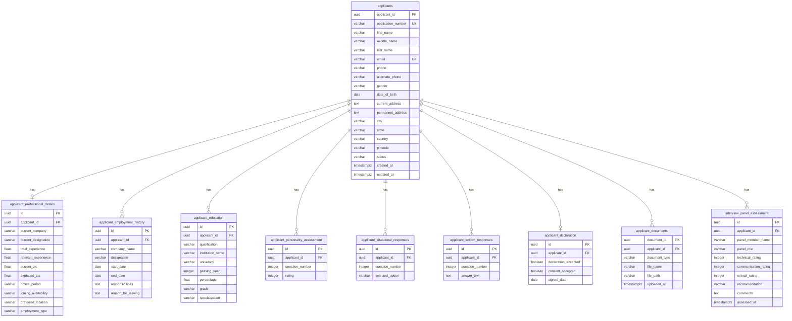

# ATLAS HR Project — Applicant Form Database Documentation

## Overview

The Applicant Form module uses **10 normalized PostgreSQL tables** to store application data across 8 applicant-facing sections, a document upload table, and 1 internal assessment table. All tables use UUID primary keys and are related through `applicant_id` foreign keys with `ON DELETE CASCADE`.

---

## Entity-Relationship Diagram



---

## Table Details

### 1. `applicants` — Section 1: Personal Details

The core table storing applicant identity and application status.

| Column | Type | Nullable | Default | Notes |
|--------|------|----------|---------|-------|
| `applicant_id` | UUID | NO | `uuid_generate_v4()` | Primary Key |
| `application_number` | VARCHAR(30) | NO | — | Unique, auto-generated: `ATLAS-APP-YYYYMMDD-XXXX` |
| `first_name` | VARCHAR(50) | NO | — | |
| `middle_name` | VARCHAR(50) | YES | — | |
| `last_name` | VARCHAR(50) | NO | — | |
| `email` | VARCHAR(100) | NO | — | Unique, indexed |
| `phone` | VARCHAR(15) | NO | — | 10-digit validation at app level |
| `alternate_phone` | VARCHAR(15) | YES | — | |
| `gender` | VARCHAR(10) | NO | — | MALE, FEMALE, OTHER |
| `date_of_birth` | DATE | NO | — | Must not be future date |
| `current_address` | TEXT | NO | — | |
| `permanent_address` | TEXT | YES | — | |
| `city` | VARCHAR(50) | NO | — | |
| `state` | VARCHAR(50) | NO | — | |
| `country` | VARCHAR(50) | NO | — | |
| `pincode` | VARCHAR(10) | NO | — | |
| `status` | VARCHAR(20) | NO | `'DRAFT'` | DRAFT, SUBMITTED, UNDER_REVIEW, SHORTLISTED, REJECTED, HIRED |
| `created_at` | TIMESTAMPTZ | YES | `NOW()` | |
| `updated_at` | TIMESTAMPTZ | YES | `NOW()` | Auto-updated on changes |

**Indexes:** `applicant_id` (PK), `email` (unique), `application_number` (unique), `status`

---

### 2. `applicant_professional_details` — Section 2

One-to-one relationship with `applicants`.

| Column | Type | Nullable | Notes |
|--------|------|----------|-------|
| `id` | UUID | NO | PK |
| `applicant_id` | UUID | NO | FK → applicants, UNIQUE |
| `current_company` | VARCHAR(100) | YES | |
| `current_designation` | VARCHAR(100) | YES | |
| `total_experience` | FLOAT | NO | ≥ 0 |
| `relevant_experience` | FLOAT | NO | ≥ 0 |
| `current_ctc` | FLOAT | YES | ≥ 0 |
| `expected_ctc` | FLOAT | YES | ≥ 0 |
| `notice_period` | VARCHAR(50) | YES | |
| `joining_availability` | VARCHAR(50) | YES | |
| `preferred_location` | VARCHAR(100) | YES | |
| `employment_type` | VARCHAR(20) | NO | FULL_TIME, PART_TIME, CONTRACT, INTERN |

---

### 3. `applicant_employment_history` — Section 3

One-to-many relationship with `applicants`.

| Column | Type | Nullable | Notes |
|--------|------|----------|-------|
| `id` | UUID | NO | PK |
| `applicant_id` | UUID | NO | FK → applicants |
| `company_name` | VARCHAR(100) | NO | |
| `designation` | VARCHAR(100) | NO | |
| `start_date` | DATE | NO | |
| `end_date` | DATE | YES | Must be ≥ start_date |
| `responsibilities` | TEXT | YES | |
| `reason_for_leaving` | TEXT | YES | |

---

### 4. `applicant_education` — Section 4

One-to-many relationship with `applicants`.

| Column | Type | Nullable | Notes |
|--------|------|----------|-------|
| `id` | UUID | NO | PK |
| `applicant_id` | UUID | NO | FK → applicants |
| `qualification` | VARCHAR(100) | NO | |
| `institution_name` | VARCHAR(150) | NO | |
| `university` | VARCHAR(150) | YES | |
| `passing_year` | INTEGER | NO | 1900–current year |
| `percentage` | FLOAT | YES | 0–100 |
| `grade` | VARCHAR(10) | YES | |
| `specialization` | VARCHAR(100) | YES | |

---

### 5. `applicant_personality_assessment` — Section 5

One-to-many with unique constraint on `(applicant_id, question_number)`.

| Column | Type | Nullable | Constraint |
|--------|------|----------|------------|
| `id` | UUID | NO | PK |
| `applicant_id` | UUID | NO | FK → applicants |
| `question_number` | INTEGER | NO | Part of unique constraint |
| `rating` | INTEGER | NO | CHECK: 1 ≤ rating ≤ 5 |

---

### 6. `applicant_situational_responses` — Section 6

One-to-many with unique constraint on `(applicant_id, question_number)`.

| Column | Type | Nullable | Constraint |
|--------|------|----------|------------|
| `id` | UUID | NO | PK |
| `applicant_id` | UUID | NO | FK → applicants |
| `question_number` | INTEGER | NO | Part of unique constraint |
| `selected_option` | VARCHAR(1) | NO | CHECK: IN ('A','B','C','D') |

---

### 7. `applicant_written_responses` — Section 7

One-to-many with unique constraint on `(applicant_id, question_number)`.

| Column | Type | Nullable | Notes |
|--------|------|----------|-------|
| `id` | UUID | NO | PK |
| `applicant_id` | UUID | NO | FK → applicants |
| `question_number` | INTEGER | NO | Part of unique constraint |
| `answer_text` | TEXT | NO | Min 20 chars, max 2000 chars |

---

### 8. `applicant_declaration` — Section 8

One-to-one relationship with `applicants`.

| Column | Type | Nullable | Notes |
|--------|------|----------|-------|
| `id` | UUID | NO | PK |
| `applicant_id` | UUID | NO | FK → applicants, UNIQUE |
| `declaration_accepted` | BOOLEAN | NO | Must be TRUE for submission |
| `consent_accepted` | BOOLEAN | NO | Must be TRUE for submission |
| `signed_date` | DATE | YES | |

---

### 9. `applicant_documents` — Signature Upload

One-to-many relationship with `applicants`.

| Column | Type | Nullable | Notes |
|--------|------|----------|-------|
| `document_id` | UUID | NO | PK |
| `applicant_id` | UUID | NO | FK → applicants |
| `document_type` | VARCHAR(30) | NO | Currently: `SIGNATURE_PDF` |
| `file_name` | VARCHAR(255) | NO | Original filename |
| `file_path` | VARCHAR(500) | NO | Server-side storage path |
| `uploaded_at` | TIMESTAMPTZ | YES | Server default: NOW() |

---

### 10. `interview_panel_assessment` — Section 9 (Internal Only)

One-to-many relationship with `applicants`. **NOT exposed via applicant APIs.**

| Column | Type | Nullable | Notes |
|--------|------|----------|-------|
| `id` | UUID | NO | PK |
| `applicant_id` | UUID | NO | FK → applicants |
| `panel_member_name` | VARCHAR(100) | YES | |
| `panel_role` | VARCHAR(50) | YES | |
| `technical_rating` | INTEGER | YES | |
| `communication_rating` | INTEGER | YES | |
| `overall_rating` | INTEGER | YES | |
| `recommendation` | VARCHAR(20) | YES | HIRE, REJECT, HOLD |
| `comments` | TEXT | YES | |
| `assessed_at` | TIMESTAMPTZ | YES | Server default: NOW() |

---

## Cascading Behavior

All child tables use `ON DELETE CASCADE` on the `applicant_id` foreign key. Deleting an applicant record will automatically delete all related:
- Professional details
- Employment history
- Education records
- Personality assessments
- Situational responses
- Written responses
- Declaration
- Documents (metadata only — physical files remain on disk)
- Interview panel assessments

---

## File Storage

Signature PDFs are stored at:

```
backend/uploads/signatures/{applicant_id}_{timestamp}.pdf
```

- Directory is auto-created on first upload
- File metadata is stored in `applicant_documents` table
- Physical files are NOT deleted when database records are cascaded (by design — preserving audit trail)
