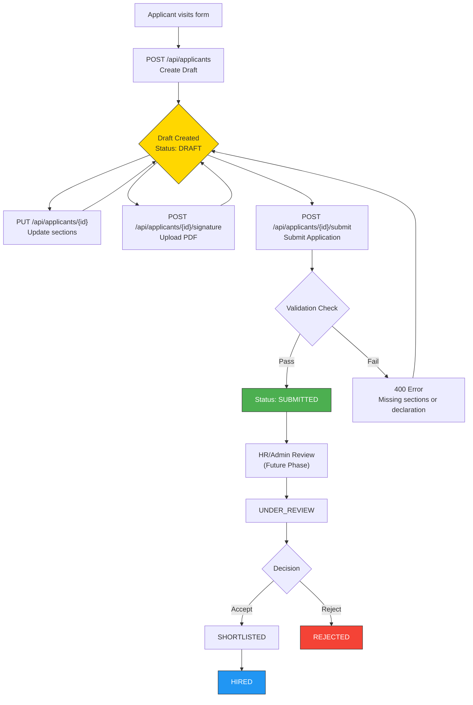
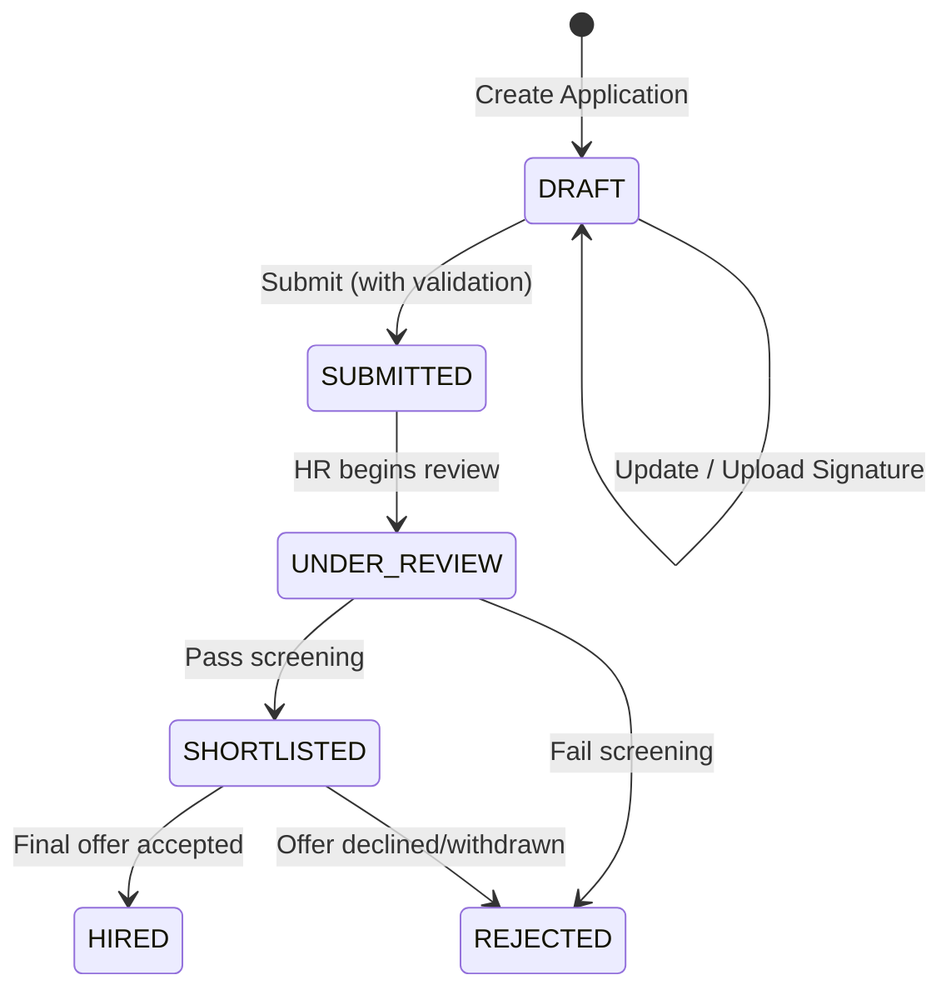
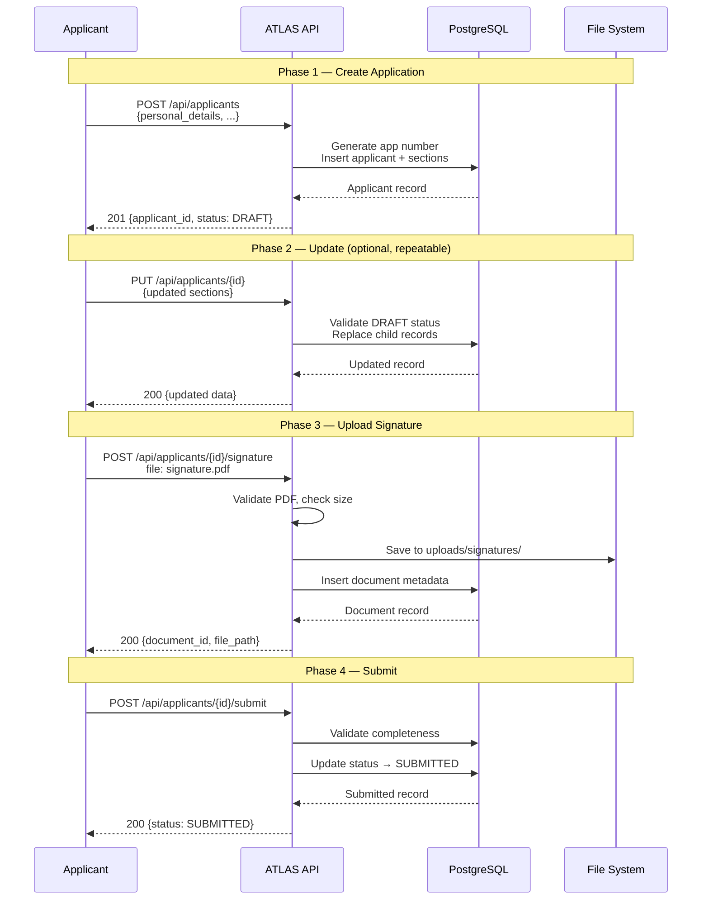
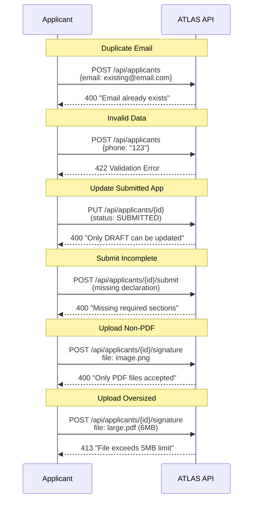
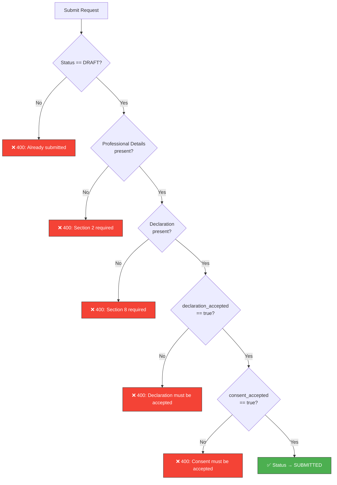
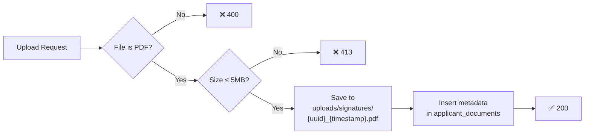

# ATLAS HR Project — Applicant Form Flow Documentation

## Overview

This document describes the complete application lifecycle, API call sequences, and status transition rules for the Applicant Form Intake Module.

---

## Application Lifecycle

---

## Status Transition Rules

| From | To | Trigger | Conditions |
|------|----|---------|------------|
| — | `DRAFT` | `POST /api/applicants` | Valid Section 1 data |
| `DRAFT` | `DRAFT` | `PUT /api/applicants/{id}` | Application exists, status is DRAFT |
| `DRAFT` | `SUBMITTED` | `POST /api/applicants/{id}/submit` | Professional details present, declaration accepted |
| `SUBMITTED` | `UNDER_REVIEW` | (future) Admin API | Admin/HR action |
| `UNDER_REVIEW` | `SHORTLISTED` | (future) Admin API | HR decision |
| `UNDER_REVIEW` | `REJECTED` | (future) Admin API | HR decision |
| `SHORTLISTED` | `HIRED` | (future) Admin API | Final hire decision |

> **Note:** Only `DRAFT → DRAFT` and `DRAFT → SUBMITTED` transitions are implemented in Phase 1. All other transitions will be added when the HR/Admin review module is built.

---

## API Call Sequence — Happy Path

---

## API Call Sequence — Error Scenarios

---

## Submission Validation Checklist

When `POST /api/applicants/{id}/submit` is called, the system validates:

---

## File Upload Flow

---

## Data Flow Summary

| Section | Table | Relationship | API Input Key |
|---------|-------|-------------|---------------|
| 1. Personal Details | `applicants` | — | `personal_details` |
| 2. Professional Details | `applicant_professional_details` | One-to-one | `professional_details` |
| 3. Employment History | `applicant_employment_history` | One-to-many | `employment_history` |
| 4. Education | `applicant_education` | One-to-many | `education` |
| 5. Your Perspective | `applicant_personality_assessment` | One-to-many | `personality_assessment` |
| 6. Workplace Scenarios | `applicant_situational_responses` | One-to-many | `situational_responses` |
| 7. Descriptive Questions | `applicant_written_responses` | One-to-many | `written_responses` |
| 8. Declaration | `applicant_declaration` | One-to-one | `declaration` |
| Signature | `applicant_documents` | One-to-many | File upload |
| 9. Interview Panel | `interview_panel_assessment` | One-to-many | NOT EXPOSED |
