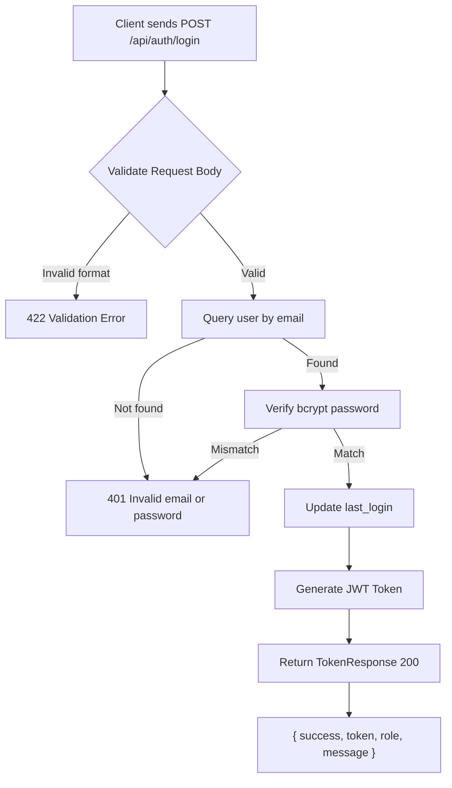
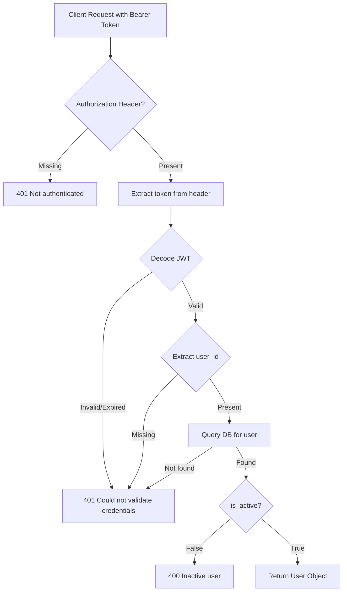
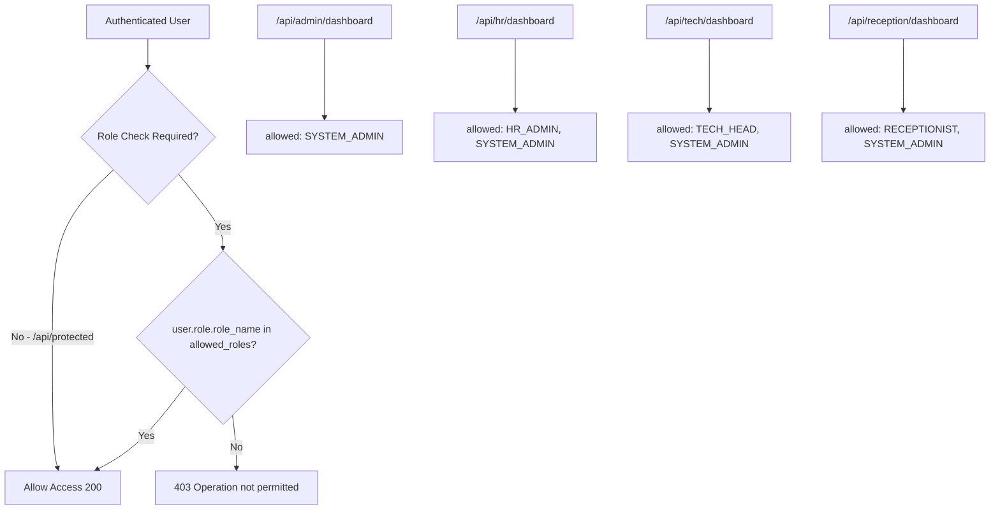
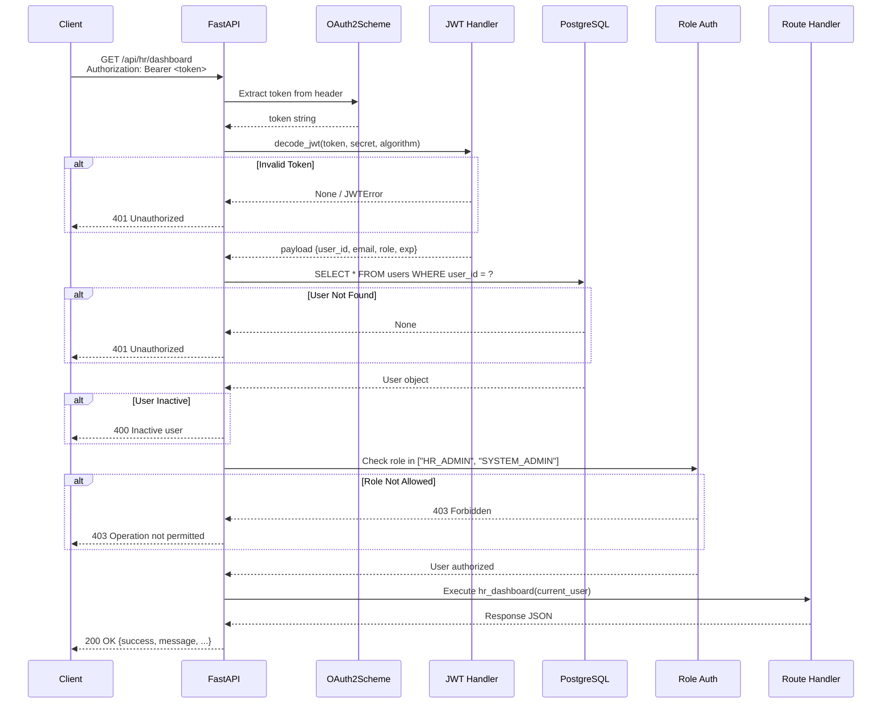

# ATLAS Authentication & Authorization Documentation

> **Version:** 1.0.0  
> **Last Updated:** 2026-06-21  
> **System:** ATLAS Interview Management System

---

## Table of Contents

1. [Overview](#1-overview)
2. [Login Flow](#2-login-flow)
3. [JWT Generation](#3-jwt-generation)
4. [JWT Validation](#4-jwt-validation)
5. [Role Validation](#5-role-validation)
6. [Middleware Flow](#6-middleware-flow)
7. [Request Lifecycle](#7-request-lifecycle)
8. [Flow Diagrams](#8-flow-diagrams)
9. [File Reference](#9-file-reference)

---

## 1. Overview

ATLAS uses a stateless authentication system based on JWT (JSON Web Tokens) combined with Role-Based Access Control (RBAC). The system has three layers of security:

| Layer | Component | Purpose |
|-------|-----------|---------|
| **Authentication** | JWT Bearer Token | Verify user identity |
| **Validation** | `get_current_user` middleware | Decode & validate token, fetch user |
| **Authorization** | `require_role` middleware | Enforce role-based access |

### Security Stack

```
passlib[bcrypt]     → Password hashing & verification
python-jose[crypto] → JWT encoding & decoding (HS256)
FastAPI Depends     → Dependency injection for auth middleware
OAuth2PasswordBearer → Token extraction from headers
Pydantic v2         → Request/response validation
```

---

## 2. Login Flow

### Endpoint: `POST /api/auth/login`

### Step-by-Step Process

```
1. Client sends POST request with email and password
     ↓
2. FastAPI validates request body against LoginRequest schema
   • email must be valid EmailStr format
   • password must be a non-empty string
   • On validation failure → 422 Unprocessable Entity
     ↓
3. authenticate_user(db, email, password) is called
   a. Query database: SELECT * FROM users WHERE email = ?
   b. If user not found → return False
   c. Verify password: bcrypt.verify(plain_password, stored_hash)
   d. If password mismatch → return False
   e. If both pass → return User object
     ↓
4. If authentication fails → 401 Unauthorized
   {"detail": "Invalid email or password"}
     ↓
5. If authentication succeeds:
   a. Update user's last_login timestamp
   b. Generate JWT access token
   c. Determine welcome message based on role
   d. Return TokenResponse
```

### Source Files

| File | Function | Purpose |
|------|----------|---------|
| `routes/auth.py` | `login()` | Route handler |
| `services/auth_service.py` | `authenticate_user()` | Credential verification |
| `services/auth_service.py` | `update_last_login()` | Update login timestamp |
| `services/auth_service.py` | `create_access_token_for_user()` | Generate JWT |
| `utils/password_handler.py` | `verify_password()` | bcrypt comparison |
| `schemas/auth.py` | `LoginRequest` | Input validation |
| `schemas/auth.py` | `TokenResponse` | Output format |

---

## 3. JWT Generation

### Function: `create_access_token_for_user(user, expires_delta)`

**File:** `services/auth_service.py`

### Token Payload

```json
{
  "user_id": "a477f9e7-36dc-48f5-94ad-f126d481c926",
  "email": "admin@atlas.com",
  "role": "SYSTEM_ADMIN",
  "exp": 1782055167
}
```

### Generation Process

```
1. Build payload dictionary:
   • user_id  → str(user.user_id)   # UUID converted to string
   • email    → user.email
   • role     → user.role.role_name  # From Role relationship
   • exp      → UTC now + expires_delta (default: 30 min)

2. Read SECRET_KEY and ALGORITHM from environment

3. Call encode_jwt(payload, secret_key, algorithm)
   • jose.jwt.encode(payload, secret_key, algorithm="HS256")
   • Note: encode_jwt adds another "exp" field via to_encode.update({"exp": expire})
     This means the token gets double-exp (both from caller and encoder)
     The second update overwrites the first, so the final exp is from encode_jwt
```

### Configuration

| Variable | Default | Source |
|----------|---------|--------|
| `SECRET_KEY` | `my_super_secret_key_123456` | `.env` |
| `ALGORITHM` | `HS256` | `.env` |
| `ACCESS_TOKEN_EXPIRE_MINUTES` | `30` | `.env` |

---

## 4. JWT Validation

### Function: `get_current_user(token, db)`

**File:** `middleware/auth.py`

### Validation Pipeline

```
1. Token Extraction
   • OAuth2PasswordBearer extracts token from "Authorization: Bearer <token>" header
   • If header is missing → 401 Unauthorized (automatic by FastAPI)

2. Token Decoding
   • decode_jwt(token, SECRET_KEY, ALGORITHM)
   • jose.jwt.decode(token, secret_key, algorithms=["HS256"])
   • Verifies signature and expiration automatically
   • If invalid/expired → JWTError raised → 401 Unauthorized

3. Payload Extraction
   • Extract user_id from decoded payload
   • If user_id is None → 401 Unauthorized

4. User Lookup
   • db.query(User).filter(User.user_id == user_id).first()
   • If user not found → 401 Unauthorized

5. Active Check
   • If user.is_active is False → 400 Bad Request ("Inactive user")

6. Return user object for use in route handler
```

### Error Responses

| Scenario | Status | Detail |
|----------|--------|--------|
| No Authorization header | 401 | `Not authenticated` |
| Invalid token format | 401 | `Could not validate credentials` |
| Expired token | 401 | `Could not validate credentials` |
| Tampered token | 401 | `Could not validate credentials` |
| Valid token, user deleted | 401 | `Could not validate credentials` |
| Valid token, user inactive | 400 | `Inactive user` |

---

## 5. Role Validation

### Function: `require_role(allowed_roles)`

**File:** `middleware/role_auth.py`

### Mechanism

```python
def require_role(allowed_roles: list):
    def role_checker(current_user: User = Depends(get_current_user)):
        if current_user.role.role_name not in allowed_roles:
            raise HTTPException(
                status_code=403,
                detail="Operation not permitted",
            )
        return current_user
    return Depends(role_checker)
```

### Pre-Defined Role Checkers

| Variable | Allowed Roles | Used By |
|----------|--------------|---------|
| `require_system_admin` | `["SYSTEM_ADMIN"]` | `/api/admin/dashboard` |
| `require_hr_admin` | `["HR_ADMIN", "SYSTEM_ADMIN"]` | `/api/hr/dashboard` |
| `require_tech_head` | `["TECH_HEAD", "SYSTEM_ADMIN"]` | `/api/tech/dashboard` |
| `require_receptionist` | `["RECEPTIONIST", "SYSTEM_ADMIN"]` | `/api/reception/dashboard` |

### Key Design Decision

> **SYSTEM_ADMIN is included in every role checker**, making it a superuser with access to all role-restricted endpoints.

### Role Check Flow

```
1. FastAPI calls role_checker as a dependency
2. role_checker calls get_current_user (authentication)
3. If authentication fails → 401 propagates up
4. Compare user.role.role_name against allowed_roles list
5. If role not in list → 403 Forbidden
6. If role is in list → return user, continue to handler
```

---

## 6. Middleware Flow

### Authentication Middleware Stack

```
┌─────────────────────────────────────────────┐
│              FastAPI Router                   │
│                                              │
│  ┌──────────────────────────────────────┐   │
│  │    OAuth2PasswordBearer              │   │
│  │    Extracts "Bearer <token>"         │   │
│  │    from Authorization header         │   │
│  └──────────────┬───────────────────────┘   │
│                 ↓                            │
│  ┌──────────────────────────────────────┐   │
│  │    get_current_user                  │   │
│  │    1. decode_jwt(token)              │   │
│  │    2. Extract user_id               │   │
│  │    3. Query User from DB            │   │
│  │    4. Check is_active               │   │
│  │    Returns: User object             │   │
│  └──────────────┬───────────────────────┘   │
│                 ↓                            │
│  ┌──────────────────────────────────────┐   │
│  │    require_role (optional)           │   │
│  │    Checks user.role.role_name        │   │
│  │    against allowed_roles list        │   │
│  └──────────────┬───────────────────────┘   │
│                 ↓                            │
│  ┌──────────────────────────────────────┐   │
│  │    Route Handler                     │   │
│  │    Business logic executes           │   │
│  └──────────────────────────────────────┘   │
└─────────────────────────────────────────────┘
```

### Dependency Chain

```
Route Handler
  └── Depends(get_current_user)          # Authentication
        └── Depends(oauth2_scheme)       # Token extraction
        └── Depends(get_db)              # Database session
  └── dependencies=[require_role(...)]   # Authorization (if role-restricted)
        └── Depends(get_current_user)    # Re-authenticates (deduped by FastAPI)
```

---

## 7. Request Lifecycle

### Complete Request Flow (Protected + Role-Restricted Endpoint)

```
Client Request
    │
    ▼
┌─────────────────────┐
│  HTTP Request        │
│  GET /api/hr/dashboard│
│  Authorization:      │
│  Bearer eyJhbG...    │
└─────────┬───────────┘
          │
          ▼
┌─────────────────────┐     ┌──────────┐
│  OAuth2PasswordBearer│────▶│ Extract  │
│  (FastAPI Security)  │     │ Token    │
└─────────┬───────────┘     └──────────┘
          │
          ▼
┌─────────────────────┐     ┌──────────────────┐
│  decode_jwt()        │────▶│ Verify Signature │
│  (utils/jwt_handler) │     │ Check Expiry     │
└─────────┬───────────┘     └──────────────────┘
          │
          │ payload = {user_id, email, role, exp}
          ▼
┌─────────────────────┐     ┌──────────────────┐
│  DB Query            │────▶│ SELECT * FROM    │
│  User.user_id == ?   │     │ users WHERE ...  │
└─────────┬───────────┘     └──────────────────┘
          │
          │ user object (with role relationship loaded)
          ▼
┌─────────────────────┐
│  is_active check     │──── False ──▶ 400 "Inactive user"
└─────────┬───────────┘
          │ True
          ▼
┌─────────────────────┐
│  require_role check  │
│  user.role.role_name │
│  in ["HR_ADMIN",    │
│      "SYSTEM_ADMIN"]│──── Not in list ──▶ 403 "Operation not permitted"
└─────────┬───────────┘
          │ In list
          ▼
┌─────────────────────┐
│  Route Handler       │
│  hr_dashboard()      │
│  Returns 200 JSON    │
└─────────────────────┘
```

---

## 8. Flow Diagrams

### Authentication Flow Diagram



### JWT Validation Flow Diagram



### RBAC Flow Diagram



### Complete Request Lifecycle Diagram



---

## 9. File Reference

### Authentication Files

| File | Purpose |
|------|---------|
| `routes/auth.py` | Login and current-user endpoints |
| `middleware/auth.py` | JWT validation middleware (`get_current_user`) |
| `middleware/role_auth.py` | RBAC middleware (`require_role`) |
| `services/auth_service.py` | Authentication business logic |
| `utils/jwt_handler.py` | JWT encode/decode utilities |
| `utils/password_handler.py` | bcrypt password hashing/verification |
| `schemas/auth.py` | Pydantic models for auth requests/responses |

### Database Files

| File | Purpose |
|------|---------|
| `database/connection.py` | SQLAlchemy engine, session, and Base |
| `models/user.py` | User SQLAlchemy model |
| `models/role.py` | Role SQLAlchemy model |
| `sql/insert_roles.sql` | Role seed data |
| `sql/create_test_users.sql` | Test user seed data |

### Configuration

| File | Purpose |
|------|---------|
| `.env` | Environment variables (SECRET_KEY, DATABASE_URL, etc.) |
| `requirements.txt` | Python dependencies |
| `app.py` | FastAPI application entry point |

---

*This documentation was generated from source code analysis of the ATLAS backend on 2026-06-21.*
